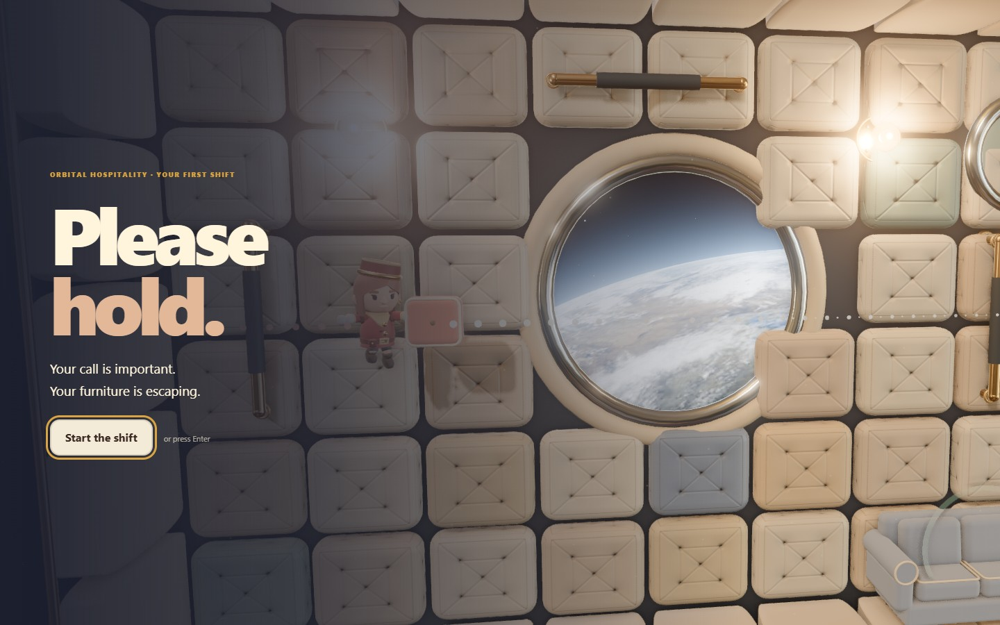
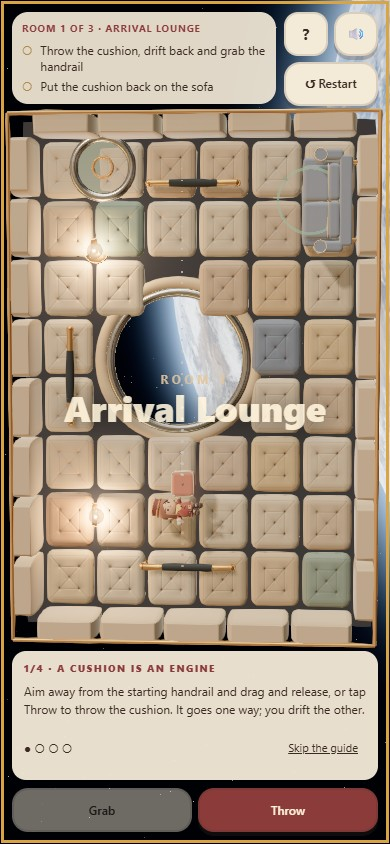
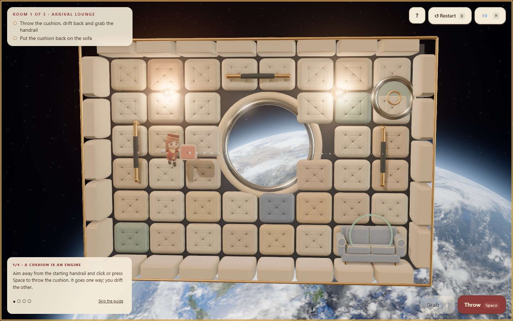

# PLEASE HOLD

<p align="center"></p>

Tidy an orbital hotel while the telephone keeps you on hold. Throw the cushion one way and drift the other. Grab a rail, recover the prop and use the same momentum to put it where it belongs. Your cleaning supplies are also your propulsion.

**[Start the orbital shift →](https://07-please-hold.williamking.workers.dev)** · [Run locally](#run-locally) · [Credits](#credits)

<p align="center"></p>

## One useful rule: shared momentum

Choose **Start the shift** or press Enter after the porthole camera tour. The first guide waits for a throw, a rail grab, cushion recovery and placement. Later help names the current task or hatch instead of repeating the first room's instructions.

Cream and coral dotted routes preview the thrown item and your recoil. A green ring marks what is in reach. Carrying a heavier item changes a push-off; grabbing a rail gives you somewhere to stop and plan.

| Action | Keyboard / mouse | Touch |
| --- | --- | --- |
| Aim | Pointer, arrows or WASD | Drag on the room |
| Throw, push off or contextual action | Click or Space | Release the drag or use the action button |
| Grab a nearby rail or item | E or right-click | Grab |
| Push off while carrying | Q | Push off carrying |
| Restart the room | R | Restart |
| Toggle sound | M | Sound |

## Three rooms, five tasks

Return a cushion, move a fern beneath its lamp, recover a drifting breakfast tray and deliver tea through the moving compartment. Complete the shift to reach the call and review card. Each room awards up to three stars against move and time targets; valid best scores stay in this browser.

The lounge uses quilted panels, brass rails, local lamp light, dust and a porthole Earth. On portrait screens the room turns to fit the available space. Short landscape layouts keep the primary actions reachable in a scrollable side panel. Reduced motion settles the opening and removes camera disturbance while preserving the same tasks.

## Engineering and verification

The 120 Hz simulation shares stepping code with trajectory prediction. Prop mass, carried items, collisions and anchored bodies are accounted for together. Rooms are prepared ahead of use to avoid a shader compilation stall at a doorway. Input, animations, loaded resources and audio have explicit lifetimes through restart and failure recovery.

Application revision `2942adf` passed **84 tests / 1,050 assertions** and nine RTX 2060 scenarios. An independent route completes every task across all three rooms with three stars; browser coverage also checks touch cancellation, contextual help, ending/replay, native focus and recovery. See the [bug-pass report](docs/visual/BUG-PASS-2026-09-30.md).

[src/game/](src/game/) holds physics and tasks; [src/scene/](src/scene/) the rooms and camera; [src/ui/](src/ui/) the task and ending controls; [src/audio/](src/audio/) the hold music and sound engine.

## Current screenshots

| Desktop | Phone |
| --- | --- |
|  |  |



The opening loop and three main screenshots were captured from the live site on **1 October 2026**, using Chrome on this workstation; the phone image is a 390 × 844 browser viewport. The animated preview is a short loop, not a full playthrough. [Capture details](docs/readme/capture.json).

## Run locally

Use **Bun 1.3.10** (the version pinned in `package.json`) and Node.js 22.12 or newer. From this repository:

```sh
bun install --frozen-lockfile
bun run dev      # http://127.0.0.1:4517/
bun run check    # strict types, Biome, unit tests and production build
bun run preview  # http://127.0.0.1:4617/ after the build
```

Development and preview are separate long-running commands; run one at a time or use separate terminals. `bun run build` writes the static production output to `dist/`. Dependencies and the lockfile are local to this project.

### Browser suite

Install the test browser once, then run the checked-in Playwright suite. Its configuration builds and starts the production preview. Browser scenarios are separate from `bun run check`.

```sh
bunx playwright install chromium
bun run e2e
```

The recorded real-GPU release checks used installed Chrome on an RTX 2060; the default Chromium configuration is not a claim of physical-phone coverage.

## Stack and release

Direct Three.js 0.186 · React 19.3 · strict TypeScript · Vite 8.3 · GSAP 3.15 · Tailwind CSS 4.3 · Bun 1.3.10 · Biome. The public website is served by Cloudflare Workers. This README describes [application revision 2942adf](https://github.com/WilliamHenryKing/07-please-hold/commit/2942adf2b0e0bc3be61543698050bee28ac68ed9); the documentation refresh changes no application behaviour.

## Credits

Design and code for the portfolio collection. Geometry is modelled in code; the finale's phone ring is synthesised with Web Audio; text uses the system font stack. Every shipped asset is listed with its source, licence and sha256 in [`assets.manifest.json`](assets.manifest.json). Shipped assets total about 5.5 MB.

### Visual assets

| Files in `public/textures/` | Use | Source | Author | Licence |
| --- | --- | --- | --- | --- |
| `upholstery/*` (baked from Leather 037 plus a procedural tuft field) | Quilted panels, pads, buttons | [ambientCG Leather037](https://ambientcg.com/view?id=Leather037) | ambientCG | CC0 |
| `brass/*` (from Metal 054 A) | Brass rails and trims, steel rims | [ambientCG Metal054A](https://ambientcg.com/view?id=Metal054A) | ambientCG | CC0 |
| `fabric/wool_boucle_*` | Sofa, guest seat, cushion | [Poly Haven Wool Boucle](https://polyhaven.com/a/wool_boucle) (via ODD TIDE) | Poly Haven | CC0 |
| `cloth/rough_linen_*` | Uniforms, lamp shade | [Poly Haven Rough Linen](https://polyhaven.com/a/rough_linen) (via ODD TIDE) | Poly Haven | CC0 |
| `env/anniversary_lounge_1k.hdr` | Image-based light and reflections | [Poly Haven Anniversary Lounge](https://polyhaven.com/a/anniversary_lounge) | Greg Zaal | CC0 |
| `planet/earth_day_2k.webp` | Earth, day side | [NASA Blue Marble Next Generation](https://visibleearth.nasa.gov/images/73909/december-blue-marble-next-generation-w-topography-and-bathymetry) | NASA Earth Observatory | Public domain |
| `planet/earth_clouds_2k.webp` | Cloud cover | [NASA Blue Marble: Clouds](https://visibleearth.nasa.gov/images/57747/blue-marble-clouds) | NASA Visible Earth | Public domain |
| `planet/earth_night_2k.webp` | City lights on the night side | [NASA Black Marble 2016](https://visibleearth.nasa.gov/images/144898/earth-at-night-black-marble-2016-color-maps) | NASA Earth Observatory | Public domain |

The renderer's post-processing chain and material patterns are adapted from ODD TIDE (same portfolio collection, reused with permission).

### Audio (all CC0 1.0, public domain)

Sound starts on the first click, tap or key press. The files load after that and total about 2 MB in `public/audio/`. The game pauses audio while the tab is hidden, ducks the music under jingles, and remembers the mute setting (M or the speaker button).

| File(s) in `public/audio/` | Use | Source | Author | Licence |
| --- | --- | --- | --- | --- |
| `hold-music.mp3` (was `Elevator.mp3`) | Background music | [opengameart.org/content/elevator-music](https://opengameart.org/content/elevator-music) | Pro Sensory | CC0 |
| `throw-0..2.ogg` (`impactSoft_medium_000..002`), `catch.ogg` (`impactSoft_medium_003`), `push-0..1.ogg` (`impactSoft_heavy_000..001`), `bump-0..1.ogg` (`impactSoft_heavy_002..003`), `rail-0..1.ogg` (`impactMetal_light_000..001`), `tap-0..2.ogg` (`impactGeneric_light_000..002`), `bonk.ogg` (`impactPunch_medium_000`) | Throws, catches, push-offs, padded bumps, rail grabs, item knocks, bonks | [Kenney Impact Sounds](https://kenney.nl/assets/impact-sounds) | Kenney (kenney.nl) | CC0 |
| `place.ogg` (`confirmation_001`), `restart.ogg` (`back_002`), `toggle.ogg` (`toggle_001`) | Delivery, room restart, mute toggle | [Kenney Interface Sounds](https://kenney.nl/assets/interface-sounds) | Kenney (kenney.nl) | CC0 |
| `task.ogg` (`jingles_PIZZI04`), `done.ogg` (`jingles_SAX07`) | Task complete, end of shift | [Kenney Music Jingles](https://kenney.nl/assets/music-jingles) | Kenney (kenney.nl) | CC0 |
| `hatch.ogg` (`doorOpen_000`), `room.ogg` (`doorClose_000`), `hum.ogg` (`spaceEngineLow_002`), `revolve.ogg` (`engineCircular_000`) | Hatch opening, entering a room, station hum ambience, revolving-compartment loop | [Kenney Sci-fi Sounds](https://kenney.nl/assets/sci-fi-sounds) | Kenney (kenney.nl) | CC0 |

The Kenney pack licence files state "Creative Commons Zero, CC0". The OpenGameArt page lists the licence as CC0. No attribution is required; it is given here anyway.

---

Part of [William King's portfolio collection](https://github.com/WilliamHenryKing).
