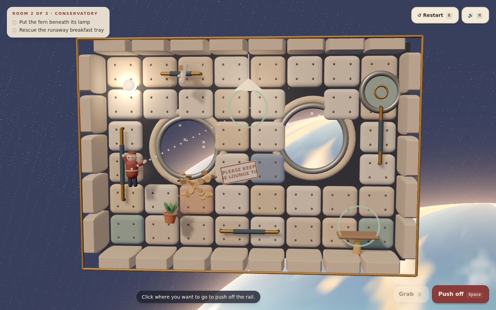
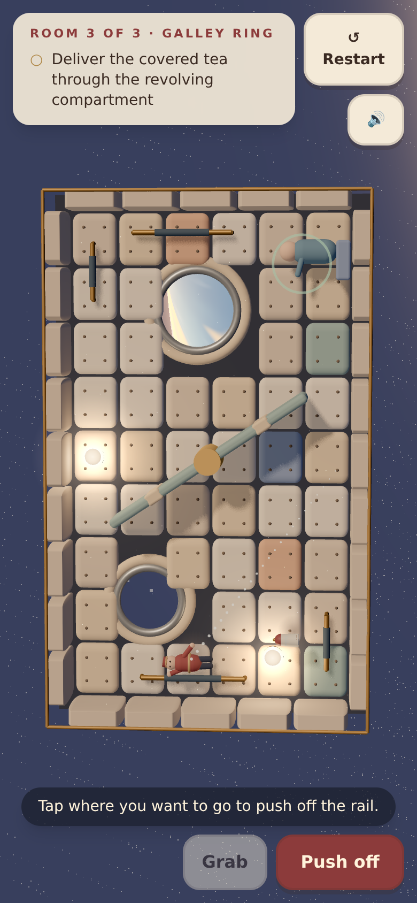

<div align="center">



<a href="https://07-please-hold.williamking.workers.dev"></a>


**You are the new attendant on a tiny orbital lounge: everything floats, you can only move by throwing things or pushing off rails, and the guests would like their tea.**


</div>

## How to play

One rule moves everything: **momentum is shared.** Throw the cushion one way and you drift the other. Grab a rail and you stop dead. Carry something heavy and your push-offs get slower. The useful item is also your propulsion.

| Action | Keyboard and mouse | Touch |
| --- | --- | --- |
| Aim | Move the pointer, or arrows / WASD | Drag on the room |
| Throw what you hold, push off the rail, or grab what is near | Click or Space | Release the drag, or the red button |
| Grab the nearest rail or item | E or right-click | **Grab** |
| Push off the rail while carrying the item | Q | **Push off carrying** |
| Restart the room | R | **Restart** |
| Mute or unmute | M | 🔊 |

Dotted guides preview every move before you commit: cream for where the thrown item (or you) will go, coral for your recoil. A green ring marks whatever is in reach.

Tidy three rooms: return the cushion to the sofa, put the fern beneath its lamp, rescue a runaway breakfast tray, and carry a covered tea flask through a slowly revolving compartment. Then the call finally connects.

## What's inside

- **One honest physics rule.** Throws, push-offs, catches and bonks all conserve momentum, so every move is predictable and every mistake is funny.
- **Three compact rooms, five tasks, one finale.** Each room is scored 1–3 stars on moves and time against par. Your bests stay in this browser. After room 3 the hold music fades, the line rings, and your shift is reviewed.
- **Warm orbital domesticity.** Quilted panels that dent when you bounce off them, brass rails, soft lamp pools, drifting dust, and a porthole onto a huge planet that shifts with parallax.
- **A camera that never makes you seasick.** It is fixed and gently tilted. On a portrait phone the room turns a quarter to fill the screen, because in orbit there is no "up".
- **Feel.** The attendant squashes along the hit, thrown things tumble, there is a faint drift trail, and hard bumps give a tiny camera nudge. All of it is toned down under `prefers-reduced-motion`.
- **Sound design.** CC0 elevator music on hold, padded thumps, brass clinks, a pizzicato jingle per task, station hum, a synthesised phone ring, and a mute that remembers.
- **Mouse, touch and keyboard.** Labelled controls, visible focus, and an in-place first-time hint.

## Screenshots

<table>
  <tr>
    <td width="72%"></td>
    <td width="28%"></td>
  </tr>
  <tr>
    <td align="center">Desktop, 1440 × 900</td>
    <td align="center">Phone, 390 × 844</td>
  </tr>
</table>

## Built with

Three.js 0.186 (used directly, no React Three Fiber), React 19, strict TypeScript, Vite 8, Tailwind CSS 4, GSAP, Biome and Bun. Every model, texture and the planet is authored procedurally in code.

Notable techniques:

- **Shared-momentum movement on a fixed 120 Hz step.** `src/game/` is pure TypeScript with no DOM: impulses, restitution, a revolving bar with surface velocity, and trajectory previews. It is covered by unit tests.
- **The portrait camera.** Framing solves for the room's long side against the HUD's safe band, turning the view a quarter on tall screens. Keyboard aiming is remapped so "up" is always screen-up.
- **An event-driven presentation layer.** The simulation emits events (throw, grab, bump, place), and the renderer, the audio mixer and the HUD each react to them independently. That keeps effects, sound and the React HUD out of the rules.

## Run it locally

```sh
bun install
bun run dev      # http://127.0.0.1:4517/
bun run check    # strict tsc, Biome, bun test, production build into dist/
bun run e2e      # optional: Playwright plays room 1 headless
```

## Credits

Design and code for the portfolio collection. All visuals are procedural; the finale's phone ring is synthesised with Web Audio; text uses the system font stack.

### Audio (all CC0 1.0, public domain)

Sound starts on the first click, tap or key press. The files load after that and total about 2 MB in `public/audio/`. The game pauses audio while the tab is hidden, ducks the music under jingles, and remembers the mute setting (M or the speaker button).

| File(s) in `public/audio/` | Use | Source | Author | Licence |
| --- | --- | --- | --- | --- |
| `hold-music.mp3` (was `Elevator.mp3`) | Background music | [opengameart.org/content/elevator-music](https://opengameart.org/content/elevator-music) | Pro Sensory | CC0 |
| `throw-0..2.ogg` (`impactSoft_medium_000..002`), `catch.ogg` (`impactSoft_medium_003`), `push-0..1.ogg` (`impactSoft_heavy_000..001`), `bump-0..1.ogg` (`impactSoft_heavy_002..003`), `rail-0..1.ogg` (`impactMetal_light_000..001`), `tap-0..2.ogg` (`impactGeneric_light_000..002`), `bonk.ogg` (`impactPunch_medium_000`) | Throws, catches, push-offs, padded bumps, rail grabs, item knocks, bonks | [Kenney Impact Sounds](https://kenney.nl/assets/impact-sounds) | Kenney (kenney.nl) | CC0 |
| `place.ogg` (`confirmation_001`), `restart.ogg` (`back_002`), `toggle.ogg` (`toggle_001`) | Delivery, room restart, mute toggle | [Kenney Interface Sounds](https://kenney.nl/assets/interface-sounds) | Kenney (kenney.nl) | CC0 |
| `task.ogg` (`jingles_PIZZI04`), `done.ogg` (`jingles_SAX07`) | Task complete, end of shift | [Kenney Music Jingles](https://kenney.nl/assets/music-jingles) | Kenney (kenney.nl) | CC0 |
| `hatch.ogg` (`doorOpen_000`), `room.ogg` (`doorClose_000`), `hum.ogg` (`spaceEngineLow_002`), `revolve.ogg` (`engineCircular_000`) | Hatch opening, entering a room, station hum ambience, revolving-compartment loop | [Kenney Sci-fi Sounds](https://kenney.nl/assets/sci-fi-sounds) | Kenney (kenney.nl) | CC0 |

The Kenney pack licence files state "Creative Commons Zero, CC0". The OpenGameArt page lists the licence as CC0. No attribution is required; it is given here anyway.

---

<p align="center">Part of William King's portfolio collection</p>
